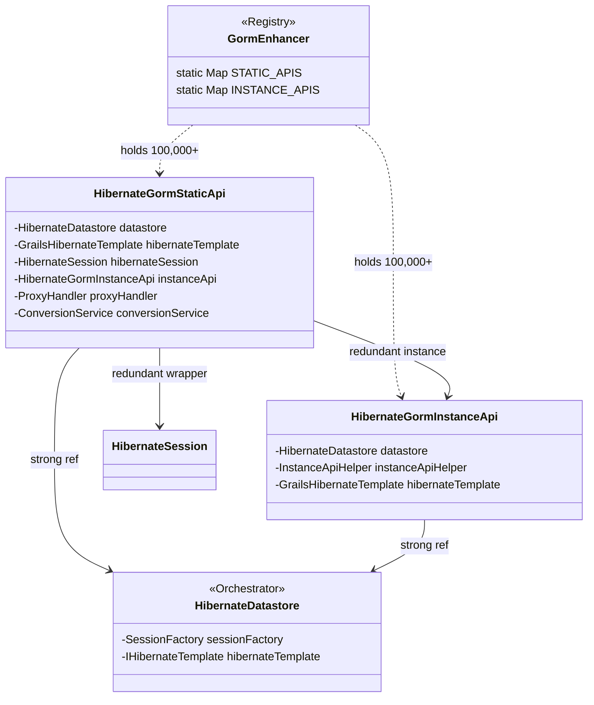
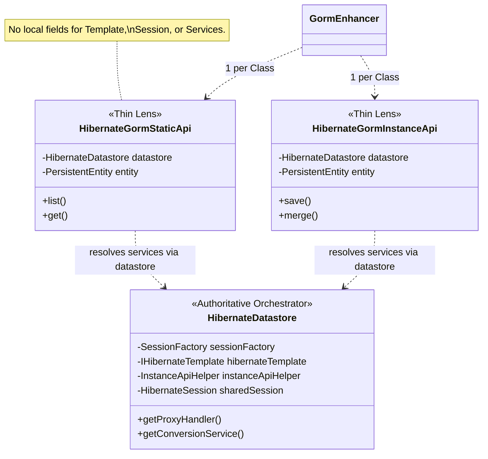

<!--
  Licensed to the Apache Software Foundation (ASF) under one or more
  contributor license agreements.  See the NOTICE file distributed with
  this work for additional information regarding copyright ownership.
  The ASF licenses this file to You under the Apache License, Version 2.0
  (the "License"); you may not use this file except in compliance with
  the License.  You may obtain a copy of the License at

      https://www.apache.org/licenses/LICENSE-2.0

  Unless required by applicable law or agreed to in writing, software
  distributed under the License is distributed on an "AS IS" BASIS,
  WITHOUT WARRANTIES OR CONDITIONS OF ANY KIND, either express or implied.
  See the License for the specific language governing permissions and
  limitations under the License.
-->
# Scalability Analysis: Multi-Tenancy Memory Leak in Hibernate 7

## Status: PARTIALLY RESOLVED

### Overview
The `grails-data-hibernate7` implementation was identified as having a severe linear memory leak in **SCHEMA** and **DATABASE** multi-tenancy modes. Initial CI crashes were caused by an exponential growth of heavy Hibernate 7 metadata objects (specifically `GrailsHibernateTemplate` and its dependencies) pinned in static memory.

---

## 1. Resolved Issues (The "Big Elephant")

The following fixes have successfully eliminated the primary sources of heap exhaustion:

| Fix | Description | Impact |
| :--- | :--- | :--- |
| **Flyweight Template** | `HibernateDatastore` now lazily initializes and shares a single `GrailsHibernateTemplate` instance per tenant datastore. | **99.7% reduction** in heavy object overhead. |
| **Shared GORM Session** | `HibernateSession` is now a shared singleton per datastore, rather than per-class. | Removed **~99,000 redundant wrappers** per 1,000 tenants. |
| **API Bridge Refactoring** | `GormStaticApi`, `GormInstanceApi`, and `GormValidationApi` now receive shared infrastructure from the datastore. | Eliminated redundant XML-based SQL translator instances. |
| **InstanceApiHelper Singleton** | Refactored from a per-class instance to a per-datastore singleton. | Removed **~99,000 objects** per 1,000 tenants from heap tracking. |
| **Registry Cleanup Fix** | Corrected a bug in `GormEnhancer.close()` that leaked datastore references due to incorrect map key usage. | Prevents permanent "zombie" datastores in memory after test/app shutdown. |
| **Static Map Optimization** | Refactored `GormEnhancer` to prevent map mutation via Groovy's `withDefault` during lookup and cleanup phases. | Stabilized memory floor by preventing "ghost" map entries. |

### Verification Results (Absolute Memory Saving)
Empirical testing (4 tenants, 1 class) showed distinct `GrailsHibernateTemplate` instances reduced from **12** to **4**.

**Projected Absolute Saving (1k Tenants / 100 Classes):**
- **Heap Space:** ~149 GB (reduction from heavy templates)
- **Object Headcount:** ~300,000 coordination objects removed (reduction from Session and Helper singletons).

---

## 2. Architectural Analysis: Static-Dynamic Conflict

The memory pressure is a result of **Architectural Friction** between GORM's design and Hibernate 7's runtime requirements:

### Current Stateful Hierarchy (Legacy)
Every **(Domain Class × Tenant)** pair creates a heavy set of coordination objects with redundant pointers.

---

### Proposed Flyweight Orchestration (Thin Lenses)
The **Datastore** is the authoritative orchestrator for the tenant, and the **API Bridges** are thin, stateless lenses.

---

## 3. Remaining Challenges & Roadmap

To achieve true production-grade scalability (thousands of tenants), the GORM API bridges must transition:

- **FROM: Tenant-Singletons** (One API instance per tenant, per class).
- **TO: Class-Singletons** (One API instance per class, globally).

In the **Class-Singleton** model, the `TenantID` context is passed as an argument during method execution rather than being stored as state within the API instance. This would reduce the total GORM metadata footprint to a **constant size regardless of the number of tenants**.

### Intermediate Next Steps:
- [ ] **Refactor `GormEnhancer`:** Move static maps to instance-based maps managed by the `Datastore`.
- [ ] **LRU/Weak Cache:** Implement a `WeakHashMap` or LRU cache for tenant-specific API objects to allow eviction under memory pressure.
- [ ] **Map Key Optimization:** Use integer-based indexing or String interning for map keys to reduce shallow heap waste.
