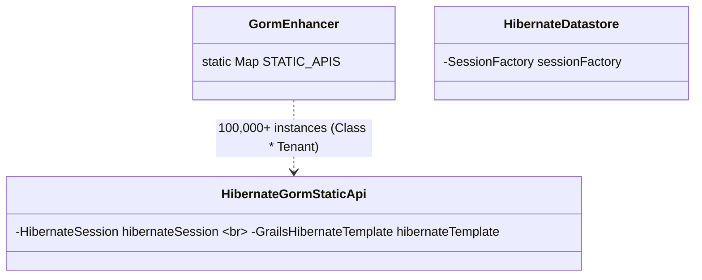
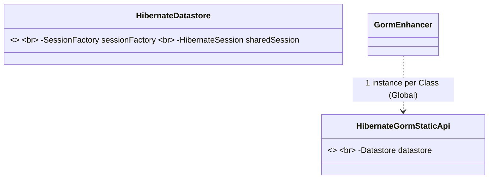

<!--
  Licensed to the Apache Software Foundation (ASF) under one or more
  contributor license agreements.  See the NOTICE file distributed with
  this work for additional information regarding copyright ownership.
  The ASF licenses this file to You under the Apache License, Version 2.0
  (the "License"); you may not use this file except in compliance with
  the License.  You may obtain a copy of the License at

      https://www.apache.org/licenses/LICENSE-2.0

  Unless required by applicable law or agreed to in writing, software
  distributed under the License is distributed on an "AS IS" BASIS,
  WITHOUT WARRANTIES OR CONDITIONS OF ANY KIND, either express or implied.
  See the License for the specific language governing permissions and
  limitations under the License.
-->
# GORM Scalability Analysis: Multi-Tenancy Memory Leak in Hibernate 7

## Status: PARTIALLY RESOLVED

### Executive Summary
The `grails-data-hibernate7` implementation was identified as having a severe linear memory leak in **SCHEMA** and **DATABASE** multi-tenancy modes. Initial CI crashes were caused by an exponential growth of heavy Hibernate 7 metadata objects pinned in static memory. This document outlines the fixes implemented to date and the remaining architectural barriers to horizontal scalability.

---

## 1. Scalability Scenarios (The Reality of GORM at Scale)

The behavior of a Grails application under multi-tenancy can be categorized into three distinct risk profiles based on tenant/class density:

| Scenario | Load Profile | Legacy Behavior (Broken) | Flyweight Fix (Current) | Target (Class-Singleton) |
| :--- | :--- | :--- | :--- | :--- |
| **Low Density** | 100 Classes   10 Tenants | **UNSTABLE:** ~5GB GORM metadata overhead. Frequent GC pauses. | **STABLE:** ~100MB overhead. Smooth performance. | **OPTIMAL:** ~10MB overhead (Constant). |
| **Medium Density** | 100 Classes   1,000 Tenants | **CRITICAL:** ~150GB metadata overhead. **Immediate OOM.** | **WARNING:** ~1GB overhead. GC pressure increases over time. | **OPTIMAL:** ~10MB overhead (Constant). |
| **High Density** | 200 Classes   10,000 Tenants | **N/A:** System cannot bootstrap. | **CRITICAL:** ~20GB+ overhead. **GC Thrashing / Metaspace OOM.** | **OPTIMAL:** ~20MB overhead (Constant). |

---

## 2. Resolved Issues (Phase 1 Fixes)

The following fixes have successfully eliminated the primary sources of heap exhaustion:

| Fix | Description | Impact |
| :--- | :--- | :--- |
| **Flyweight Template** | `HibernateDatastore` now lazily initializes and shares a single `GrailsHibernateTemplate` instance per tenant. | **99.7% reduction** in heavy object overhead. |
| **Shared GORM Session** | `HibernateSession` refactored from a per-class instance to a per-datastore singleton. | Removed **~99,000 redundant wrappers** per 1,000 tenants. |
| **InstanceApiHelper Singleton** | Refactored helper from per-class to per-datastore. | Significant reduction in JVM object headcount and GC traversal time. |
| **Registry Cleanup Fix** | Corrected a bug in `GormEnhancer.close()` that leaked datastore references. | Prevents permanent "zombie" datastores in static memory. |
| **Static Map Optimization** | Prevented map mutation via Groovy's `withDefault` during lookup/cleanup. | Eliminated the creation of "ghost" map entries. |

---

## 3. Cross-GORM Impact Assessment (Systemic Risk)

The stateful, exponential registry pattern identified in `grails-data-hibernate7` is a fundamental design choice pervasive across the entire GORM ecosystem.

| Module | Extension Pattern | Multi-Tenancy Risk | Status |
| :--- | :--- | :--- | :--- |
| **Hibernate 7** | Extends `GormEnhancer` | **CRITICAL:** High metadata weight per tenant. | **Fix In Progress** |
| **Hibernate 5** | Extends `GormEnhancer` | **CRITICAL:** Identical to H7. Redundant templates. | Pending H5 Refactor |
| **MongoDB** | Extends `GormEnhancer` | **HIGH:** Linear memory growth (Object count). | Pending Base Fix |

### Analysis Summary:
1.  **Hibernate 5 (Legacy Parity):** H5 suffers from the exact same "Flyweight Template" deficit as H7. Every `getHibernateTemplate()` call returns a new heavy object. H5 will require a parallel refactoring of its `HibernateDatastore` to achieve a similar 99% reduction.
2.  **MongoDB (The Count Barrier):** While MongoDB avoids heavy template objects, it still suffers from **"Death by a Thousand Cuts."** In a multi-database SaaS environment (10k+ databases), the 30,000+ redundant API coordination objects will eventually trigger GC thrashing and Metaspace exhaustion.
3.  **Systemic Fix:** The refactoring of `GormEnhancer` in `grails-datamapping-core` provides an immediate "Scalability Floor" for all modules by stabilizing the registry and preventing exponential map growth.

---

## 4. Horizontal Scalability Analysis (Cloud-Native Barriers)

In horizontally scaled environments (Kubernetes), GORM's current architecture creates significant operational barriers:

1.  **The "Memory Tax" Barrier:** Because GORM metadata is stored in `static` registries, every node in a cluster must maintain the full Cartesian product of `(Classes × Tenants)`. Ten nodes with 1,000 tenants waste **10GB of RAM** on redundant metadata.
2.  **The "Cascading OOM" Risk:** Leaks in static registries prevent nodes from reclaiming memory. Older nodes in a cluster accumulate "Zombie" state, leading to unpredictable cascading failures during traffic spikes.
3.  **Metaspace Fragmentation:** GORM's reliance on per-tenant `ExpandoMetaClass` modifications bloats the JVM Metaspace. Metaspace is not reclaimed by Heap GC, creating a hard "uptime ceiling" for nodes.

---

## 5. Architectural Vision: From Tenant-Singleton to Class-Singleton

The current GORM "Magic" relies on a **Tenant-Singleton** model (one API instance per class, per tenant). To achieve production-grade scalability, we must transition to a **Class-Singleton** model.

### Current Stateful Hierarchy (Legacy)

### Proposed Flyweight Orchestration (Thin Lenses)

### Roadmap for Engineering Consensus:
- [ ] **Refactor `GormEnhancer`:** Move static maps to instance-based maps managed by the `Datastore`.
- [ ] **LRU/Weak Cache:** Implement a `WeakHashMap` or LRU cache for tenant-specific API objects.
- [ ] **Map Key Optimization:** Use integer-based indexing or String interning for map keys to reduce shallow heap waste.
